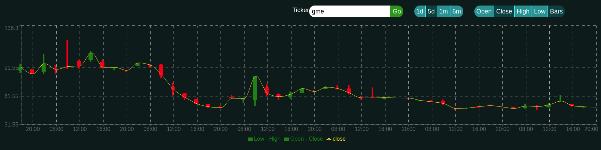

# React Stock Chart
> Query historial data for NYSE stocks in a graphical format

# View site live: [ticker](https://benjaminwgordon.github.io/ticker/)

## Table of contents
* [General info](#general-info)
* [Screenshots](#screenshots)
* [Technologies](#technologies)
* [Setup](#setup)
* [Contact](#contact)

## General info
This project queries the AlphaVantage API for historical stock data and displays it in a visual format using Recharts.

## Screenshots


## Technologies
* Recharts - ^2.0.4
* Node-Sass - ^5.0.0
* Axios - ^0.21.0

## Setup
Apply for AlphaVantage API key: [AlphaVantage](https://www.alphavantage.co/support/#api-key)
```
    $ git clone https://github.com/benjaminwgordon/ticker.git
    $ cd ticker
    $ touch .env
    Open .env with preferred text editor and add line:
        REACT_APP_ALPHAVANTAGE_API_KEY=<YourApiKey>
    $ npm start
```

## Features
List of features ready and TODOs for future development
* Query any stock from the NYSE
* Change time scale of historical data query to 1d, 5d, 1m, 6m
* Toggle stock plot and various line plots

## Contact
Created by [Ben Gordon](https://benjaminwgordon.github.io/portfolio/) - feel free to contact me!
